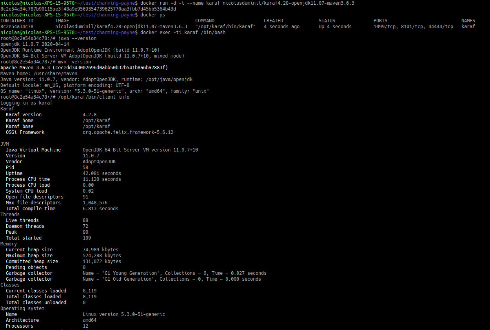

# charming-payne
A Docker image containing Apache Karaf 4.2.8

## Content
This repository contains a full operational Apache Karaf development environment,
including the following:
* Ubuntu 18.04.4 LTS (Bionic Beaver)
* AdoptOpenJDK 11.07
* Apache Maven 3.6.3
* Apache Karaf 4.2.8

## Building the image
Here are the steps required to build the image:
1. Clone the git repository:
    
    ```
    git clone https://github.com/nicolasduminil/charming-payne.git
   ```
2. Build the image

If you need to create a customized Docker container, then you need to build  
the image first, as shown below:
 
    ```
    cd charming-payne
    docker image build -t <tag> .
    ```   
If everything went well, you should see the following line in your terminal:
    
    `Successfully tagged <tag>:latest`
## Pull the image.
If you only need to use the image as it is, then you can only pull it:
    
        docker pull nicolasduminil/karaf4.28-openjdk11.07-maven3.6.3:latest
       
## Use the image
Once you've built or pulled the image, you can create a Docker container to
run it, as follows:

    docker container run -d -t <tag>
Now, you can connect to your container and check the Java and maven releases, 
as well as the Karaf ones, as shown here:

    

Enjoy !
